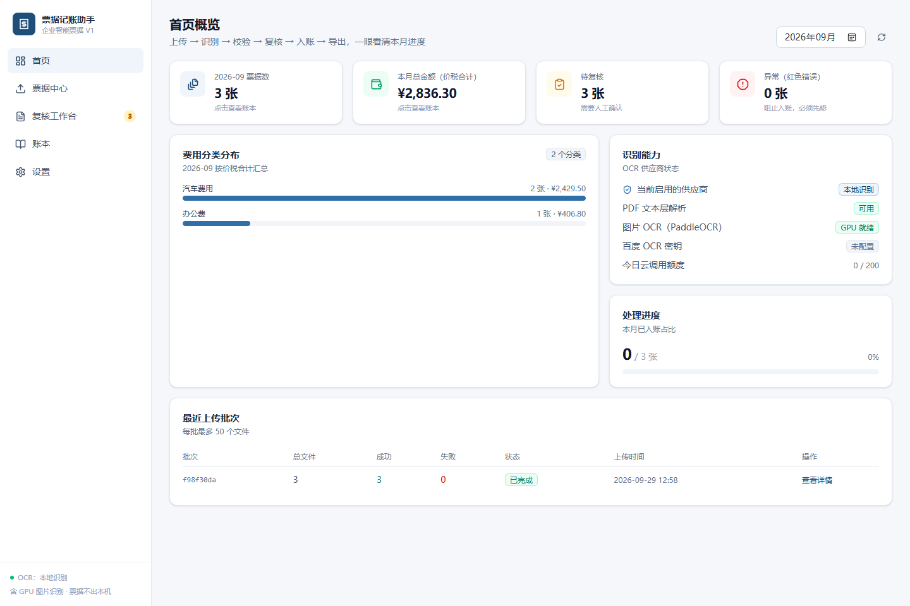
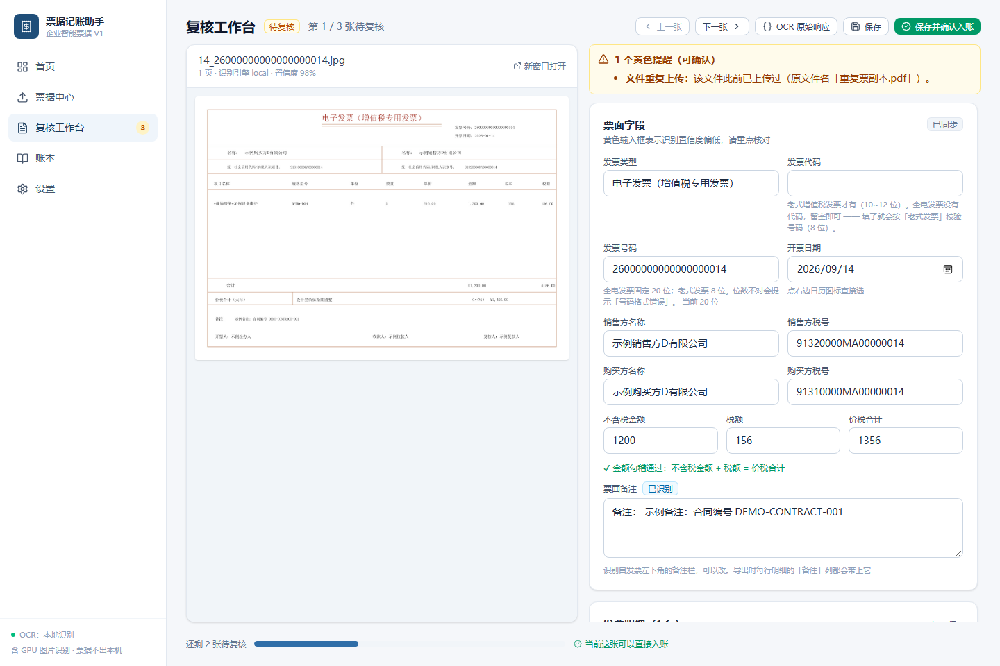
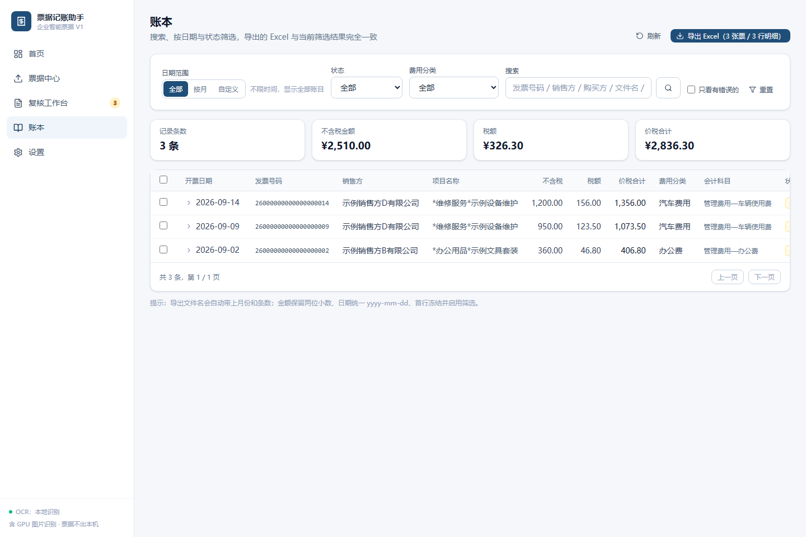
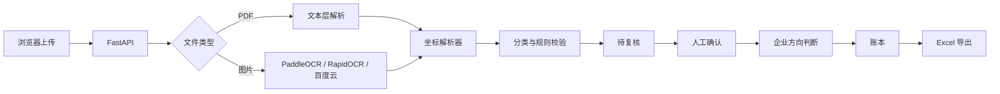

# 企业智能票据记账助手

<div align="center">


**本地运行的发票识别记账工具：上传、识别、校验、复核、入账、导出 Excel。**

默认模式下票据不离开本机。只有主动配置百度云 OCR 时，待识别文件才会发送到云端。
支持维护当前企业档案，并据此自动区分进项、销项和待判断票据。

</div>

<p align="center">
  
  
</p>

<p align="center">
  
</p>

## 项目简介

这是一个面向小微企业、代账人员和个人票据管理的本地化工具。它不依赖大模型做财务判断，而是把识别、规则校验和人工复核拆开处理：

```text
上传 -> 识别 -> 规则校验 -> 人工复核 -> 生成账目 -> 导出 Excel
```

设计原则：

- OCR 负责把票面变成结构化字段。
- 规则负责金额、票号、重复票等确定性校验。
- 人工负责最终确认，不承诺“无人审核自动入账”。
- 真实票据、数据库和导出文件默认留在本机。

## 核心能力

| 能力 | 说明 |
|---|---|
| 批量上传 | 支持 PDF、JPG、JPEG、PNG，单批最多 50 个文件 |
| PDF 文本层解析 | 直接从电子发票文本层提取坐标，速度快、不联网 |
| 图片 OCR | 可选 PaddleOCR GPU，也可接入 RapidOCR 或百度云 OCR |
| 坐标版面解析 | 按表头坐标划分名称、规格、单位、数量、单价、金额和税额列 |
| 规则校验 | 金额勾稽、必填字段、票号格式、重复票和低置信度提醒 |
| 人工复核 | 左右分栏查看原票与识别字段，修改结果实时重算风险 |
| 企业档案 | 保存当前企业名称、税号和别名，用于判断票据相对企业的方向 |
| 进销项判断 | 税号优先、名称/别名兜底，购买方匹配为进项，销售方匹配为销项 |
| 重复识别 | 用号码、日期、金额和销方税号生成业务指纹，不依赖文件哈希 |
| 分类规则 | 关键词规则自动分类，也可把人工修改沉淀为自定义规则 |
| 账本管理 | 按月份、状态、分类和关键词筛选，支持批量导出与删除 |
| 方向筛选 | 账本可按进项、销项和待判断筛选，并显示往来单位 |
| Excel 导出 | 按进销项拆分工作表，按明细行展开，包含购销双方、往来单位和金额字段 |
| 回收站 | 删除票据时移入 `data/trash/`，避免误删原票 |

## 工作流程



**这里有意不做全自动入账。** 发票识别存在 OCR 误差，金额和税号一旦识别错误，自动入账比多一步复核更危险。V1 的目标是把重复操作压缩掉，同时把最终确认权留给使用者。

## 快速开始

### 环境要求

- Windows 10/11
- Python 3.11+
- Node.js 20+

### 1. 安装后端

```powershell
python -m venv .venv
.\.venv\Scripts\python -m pip install -r backend\requirements.txt
```

### 2. 构建前端

```powershell
cd frontend
npm install
npm run build
cd ..
```

### 3. 启动

双击根目录的 `start.bat`，浏览器会自动打开：

- 应用地址：<http://127.0.0.1:8000>
- 接口文档：<http://127.0.0.1:8000/docs>

如果拿到的是预构建试用包，先运行一次：

```powershell
.\setup.bat
.\start.bat
```

`setup.bat` 会创建本机 `.venv`、安装后端依赖，并可选安装 RapidOCR 作为 CPU 图片识别方案。
无人值守安装时可使用 `.\setup.bat --no-ocr` 跳过图片 OCR。

`.venv` 只属于当前电脑，不要把它一起压缩发给别人。若试用包中意外带有其他电脑生成的 `.venv`，`setup.bat` 会自动检测、删除并重新创建。

### 开发模式

前后端分开运行时：

```text
dev_backend.bat    # FastAPI + reload，端口 8000
dev_frontend.bat   # Vite + HMR，端口 5173
```

## OCR 策略

| 文件/环境 | 默认方案 | 特点 |
|---|---|---|
| 电子发票 PDF | `pypdf` 文本层 | 不联网、速度快、坐标最稳定 |
| JPG/PNG | PaddleOCR | 本地 GPU 识别，适合批量图片票 |
| 无 PaddleOCR 环境 | RapidOCR 或人工录入 | RapidOCR 需额外安装，图片仍会保留 |
| 云端兜底 | 百度云 OCR | 显式配置密钥后启用，有日调用上限 |

PDF 的推荐路径是“文本层优先，OCR 兜底”。图片票不应伪装成 PDF 文本解析，因为扫描件没有可靠文字层，静默失败比明确提示人工录入风险更大。

## 系统架构

```text
React 19 + TypeScript + Vite
             |
          /api/v1
             |
          FastAPI
             |
    +--------+---------+
    |                  |
  OCR 适配层         业务服务层
    |                  |
  PDF/Paddle/       分类 · 校验 · 去重
  Rapid/Baidu       账本 · 导出 · 回收站
    |                  |
    +--------+---------+
             |
       SQLite + SQLAlchemy 2.0
```

核心模块：

- `backend/app/ocr/`：PDF、PaddleOCR、RapidOCR 和百度云供应商适配。
- `backend/app/ocr/parser.py`：纯函数坐标解析器，PDF 与图片 OCR 共用。
- `backend/app/services/`：流水线、分类、校验、去重、账本、导出和存储。
- `frontend/src/pages/`：首页、票据中心、复核工作台、账本和设置。

## 项目结构

```text
.
|-- backend/
|   |-- app/
|   |   |-- ocr/          # 文本层、PaddleOCR、RapidOCR、百度云
|   |   |-- routers/      # REST API
|   |   |-- services/     # 业务流水线与规则
|   |   `-- models.py     # SQLAlchemy 模型
|   |-- scripts/          # 自检、样本生成、导入导出脚本
|   |-- testdata/         # 完全合成的公开样本
|   `-- requirements.txt
|-- frontend/
|   `-- src/
|-- docs/images/          # README 截图
|-- data/                 # 本地运行数据，默认不提交
|-- setup.bat             # 预构建试用包初始化脚本
|-- start.bat
`-- README.md
```

## 配置

复制环境变量模板：

```powershell
Copy-Item backend\.env.example backend\.env
```

常用配置：

| 变量 | 默认值 | 说明 |
|---|---:|---|
| `OCR_PROVIDER` | `auto` | `auto`、`local` 或 `baidu` |
| `BAIDU_API_KEY` | 空 | 百度 OCR API Key |
| `BAIDU_SECRET_KEY` | 空 | 百度 OCR Secret Key |
| `DAILY_OCR_LIMIT` | `200` | 服务端每日云 OCR 上限 |
| `MAX_FILE_SIZE_MB` | `20` | 单文件大小上限 |
| `MAX_BATCH_FILES` | `50` | 单批文件数上限 |
| `APP_DATA_DIR` | `./data` | 数据目录重定向 |
| `APP_DB_PATH` | `./data/app.db` | 数据库路径重定向 |

`APP_DATA_DIR` 和 `APP_DB_PATH` 主要用于隔离自检或演示环境，避免误操作正在使用的真实账目。

## 自检

项目附带多条验收路径：

| 脚本 | 用途 |
|---|---|
| `backend/scripts/batch_check.py` | 5 个合成回归用例，并可批量质检指定目录 |
| `backend/scripts/e2e_check.py` | 上传、识别、复核、入账、账本和导出全流程 |
| `backend/scripts/contract_check.py` | 核对后端返回字段与前端类型契约 |
| `backend/scripts/parse_check.py` | 使用本地私有票据检查解析器，不作为公开仓库样本 |

常用命令：

```powershell
# 只运行 CI 使用的解析器回归用例
python backend\scripts\batch_check.py --self-test-only

# 解析器内置回归 + 检查公开样本
python backend\scripts\batch_check.py backend\testdata\测试发票公开版

# 后端启动后运行端到端验收
python backend\scripts\e2e_check.py

# 后端启动后检查前后端字段契约
python backend\scripts\contract_check.py
```

公开样本全部由脚本生成，不读取真实票据：

```powershell
python backend\scripts\make_public_samples.py
```

默认使用 Windows 宋体。其他系统可设置：

```powershell
$env:PUBLIC_SAMPLE_FONT_FILE="path\to\your\cjk-font.ttf"
python backend\scripts\make_public_samples.py
```

## 数据与隐私

- `data/`、`素材/`、旧版目录和本地数据库均被 `.gitignore` 排除。
- `backend/testdata/测试发票公开版/` 中的 20 个 PDF 和 8 张图片均为完全合成数据。
- 公开样本中的公司、税号、日期、项目、型号、数量、单价和金额不对应任何真实票据。
- 百度云 OCR 只有在配置密钥并显式启用后才会调用。
- 密钥只从后端环境变量或 `backend/.env` 读取，不返回前端，不写进日志。

如果部署到多人环境，请另行增加身份认证、访问控制和数据库备份策略。V1 默认是单用户本地工具。

## 已知限制

- 暂未引入 Alembic，当前使用启动时非破坏性的 `ALTER TABLE ADD COLUMN` 兼容旧库。
- 单用户、无多租户、无权限系统。
- 后台任务使用 FastAPI `BackgroundTasks`，超大批量场景应迁移到 Celery 或 RQ。
- 扫描件 PDF 和图片票依赖本地 OCR 或云端 OCR，不能只靠文本层解析。
- 分类规则是关键词规则，面对复杂业务语境仍需要人工调整。
- 暂不支持 OFD、XML 发票直接导入。

## Roadmap

- [ ] 打包免安装 Windows 绿色版
- [ ] 增加 OFD/XML 发票读取
- [ ] 增加 CSV / JSON 导出
- [ ] 增加备份与一键恢复
- [ ] 增加票据批量重识别和规则批量重跑
- [ ] 对大批量任务增加独立队列
- [ ] 支持代账场景下的多企业主体档案

## 贡献与安全

- 提交代码前请阅读 [CONTRIBUTING.md](./CONTRIBUTING.md)。
- 安全问题请阅读 [SECURITY.md](./SECURITY.md)，不要在公开 Issue 中粘贴真实票据或密钥。
- 仓库通过 GitHub Actions 执行后端编译、解析器回归、前端类型检查和构建。

## 许可证

本项目使用 [MIT License](./LICENSE)。

---

个人作品集项目。真实票据、导出文件、数据库和本地映射表不应提交到任何公开仓库。
